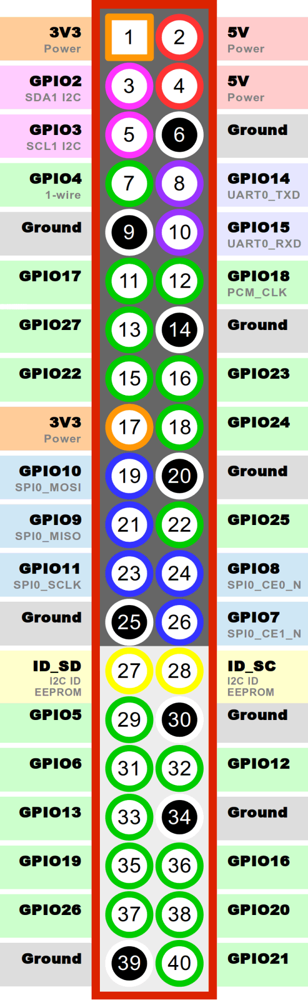
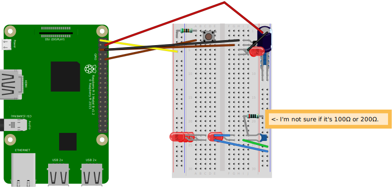

## beep2.py

### Hardware needed
- 1x Raspberry Pi
- 1x Breadboard
- Jumper wires
- 5x Red LED
- 1x Button
- 3x Resistor
- 1x NPN Transistor
- Some capacitors

### Configuration

#### GPIO Pins used
(Nr; Value; Cable color used)
- 1 (3.3V) [Yellow]
- 4 (5V) [Red]
- 5 (GPIO 3) [Brown]
- 6 (Ground) [Black]
- 10 (GPIO 15) [Brown]

### Get going
What you need to build the project yourself:  
[Python Code](beep2.py)  
[Fritzing Schematic File](beep2.fzz)  
  

The Python code has to run on the Raspberry Pi. Once it's running, it's listening for a button press on the Breadboard and then allows current to pass to whatever you build below.